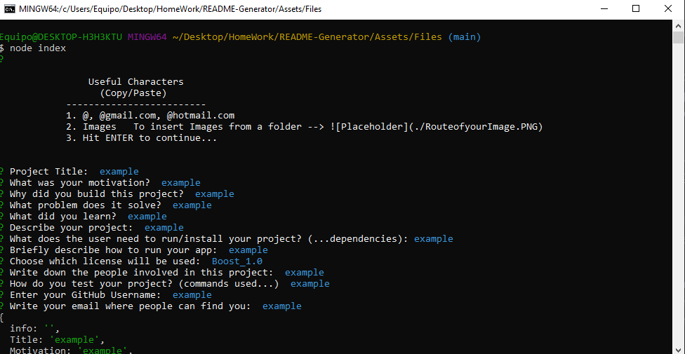

# README Generator

## Description

- What was your motivation?  
  This was an idea I had to focus more on coding, and test the abilities I have gained over the last 3 months.

- Why did you build this project?  
  It started as an idea for a simple generator, but soon turned into a real challenge, and to add more and more functionality to the project.

- What problem does it solve?  
  Saves time when writing a Quality ReadMe, and for the coder to focus more time onto coding, while presenting a quality description of their project.

- What did you learn?  
  Learned about fs, inquire and how we could prompt for the user input, and to use that input dynamically to create any type of document.
   
- Briefly describe your Project:  
  The README Generator, prompts the user a series of questions, and when answered takes those inputs and dynamically saves them and adds them to a README Template, the user can add images, email domains by copying the snnipets provided in the console to be faster at writing.

  

## Table of Contents

- [Description](#description)
- [Installation](#installation)
- [Usage](#usage)
- [License](#license)
- [Contributing](#contributing)
- [Tests](#tests)
- [Questions](#questions)

## Installation

1. Git clone this repository
2. Make sure you have Node.js installed
3. npm init -y
4. npm install inquirer

## Usage

Provide instructions for use:

After the installation of dependencies and cloning is done, type into your console:

1. Run using "node index.js"

## Features

Future Features:
-Prompt for a more aesthetic look in the console
-Welcome Message and Thank Your message.
-Pull picture of user from github
-Using Fetch to get other relevant information which will make the README more appealing.

## Questions

Check out my work: 

Find me on GitHub: 
 (https://github.com/Enrique-Rojas-Villegas)  
Email me: 📧 rojiyoyo@gmail.com
